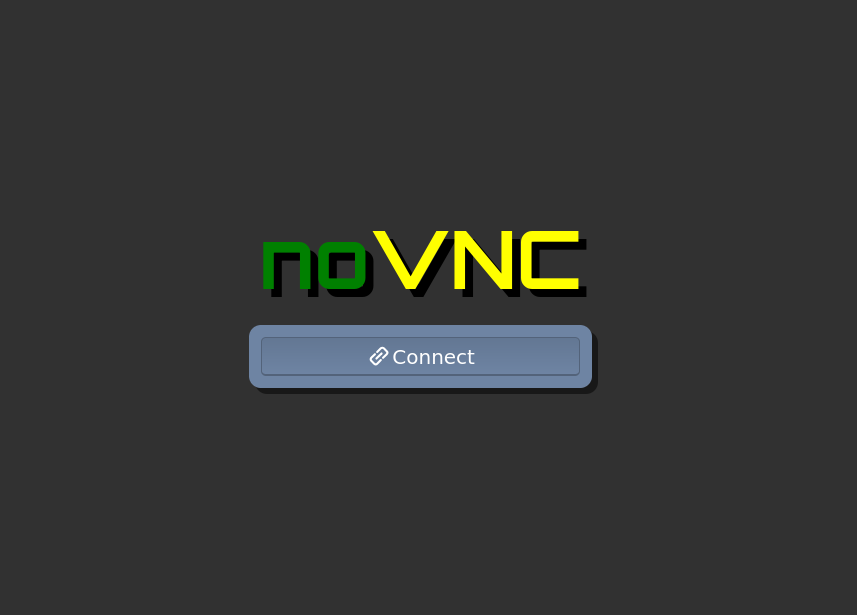
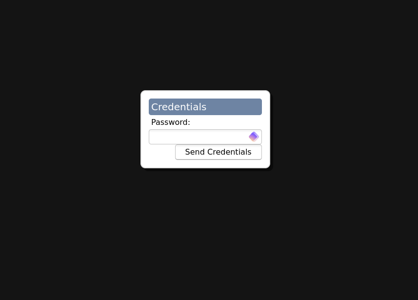
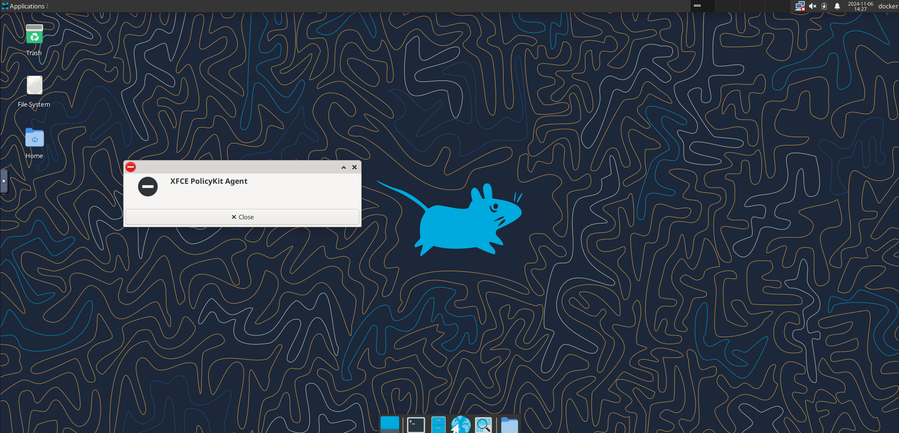
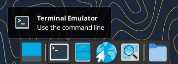
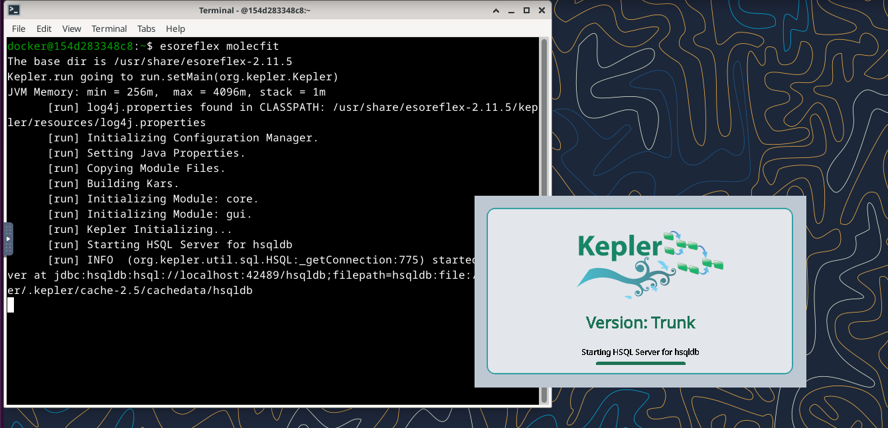
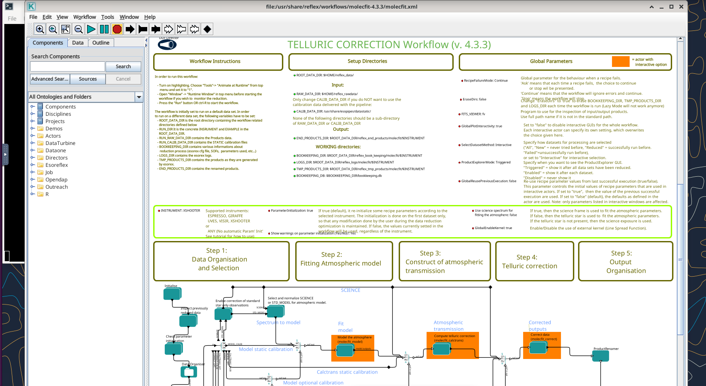

# ESO Reflex Pipeline Container

## Docker Compose

The [compose file](./compose.yml) provides an example of how to launch this image using [Docker Compose](https://docs.docker.com/compose/). This is the recommended method.

```yaml
version: '3.8'

services:
    eso-reflex:
        build:
            # Local build
            context: .
            dockerfile: Dockerfile
            # Remote from Docker Hub
            # image: obriens/eso_reflex:latest
        ports:
            - "6081:6081"
            - "5901:5901"
        volumes:
            # Path to the raw data folder
            - ./raw_data:/home/docker/reflex_rawdata:rw
            # Path to the output data folder
            - ./reflex_data:/home/docker/reflex_data:rw
```

First, modify the `compose.yml` file to match your local setup:

* For `./raw_data:/home/docker/reflex_rawdata:rw`, replace `./raw_data` with the location of your raw data folder.
* For `./reflex_data:/home/docker/reflex_data:rw`, replace `./reflex_data` with the location of your reflex data folder.

If you're using a pre-built image from Docker Hub rather than building locally, change the build section from:
```
        build:
            # Local build
            context: .
            dockerfile: Dockerfile
            # Remote from Docker Hub
            # image: obriens/eso_reflex:latest
```
to
```
        build:
            # Local build
            # context: .
            # dockerfile: Dockerfile
            # Remote from Docker Hub
            image: username/imagename:version
```

Where `username/imagename:version` corresponds to the Docker Hub username, the imagename, and the image version. For example, to use the `obriens` Docker Hub image `eso_reflex` with the `latest` version, use:
```
        build:
            # Local build
            # context: .
            # dockerfile: Dockerfile
            # Remote from Docker Hub
            image: obriens/eso_reflex:latest
```

To create a container using Docker Compose, simply run:
```
docker compose up -d
```
From the directory with `compose.yml`. Run
```
docker compose down
```
From the same directory to shut down the container.


## Pure Docker

To build the image, run:
```
docker build -t username/imagename:version .  
```
Replace `username`, `imagename` and `version` where appropriate. For example:
```
docker build -t obriens/eso_reflex:latest .
```

To run the image, execute:
```
docker run --rm -it -p 6081:6081 -p 5901:5901 username/imagename:version
```
Replacing `username`, `imagename` and `version` where appropriate.

## Connecting to noVNC server

Since the esoreflex pipeline utilizes a GUI, a graphical interface is required to access it from the container. The simplest way to achieve this is by using a [noVNC](https://novnc.com/info.html) server.

When the container is launched, the `start_server.sh` script runs, creating a noVNC server accessible at http://0.0.0.0:6081/vnc.html. The `6081` port can be modified in the compose.yml file or when running with docker run.




Once connected, you can log in using the password "password". This password can be changed in the [Dockerfile](Dockerfile):



This will bring you to a desktop environment within the container:



Note that the "XFCE PolicyKit Agent" popup is a known issue; you can simply click "close."

To start `esoreflex`, open a terminal by pressing `Ctrl + Alt + T` or by clicking the terminal icon:



Type `esoreflex molecfit`, for example, to start the `molecfit` pipeline:



After a few moments, the pipeline will load and display a graphical interface:

After a few moments the pipeline will load and open up a graphical interface:
